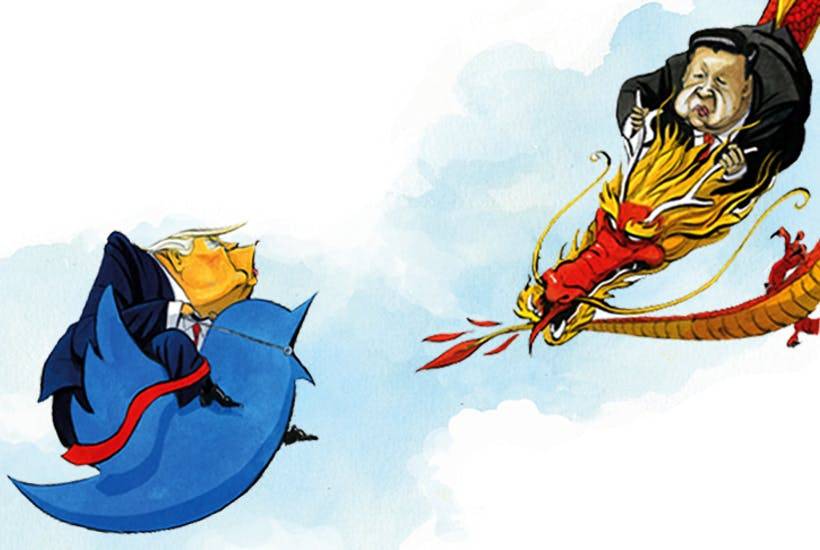

<center>

{width=800px}

</center>

```{r setup, include=FALSE}
knitr::opts_chunk$set(echo = TRUE)
```

<center>

{width=800px}

</center>

## Introduction

In this analysis, we wanted to determine the impact of Trump's tweets on various financial markets and economic indicators. Specifically, we wanted to determine the impacts of Trump tweets in relation to the recent United States - China trade war. 

## Synopsis

To do this, we obtained the tweet data from the official Trump Twitter account @realDonaldTrump, filtered to include only tweets with the word 'Trade' included. We wanted to determine the following questions through our analysis:

1. Is there a relationship between Trump Trade tweets and the stock market?
2. Is there a relationship between Trump Trade tweets on the bond markets?
3. Is there a relationship between Trump Trade tweets on various economic indicators?
  
To do this, we compared the data from January 2016 through September 2019 for the fields listed in the Data section below.

<center>

{width=600px}

</center>

## Data Wrangling
Sources of Data
We obtained our data from the following sources:
 
1. Trump 'Trade' Twitter Data: This data was obtained from the @realDonaldTrump account using a Twitter querying tool at the following web address http://www.trumptwitterarchive.com/archive. In order to verify the accuracy of the tweets queried, we selected a sample of tweets to validate on Twitter.
2. Gold: Nasdaq website
3. 10-year: FRED website
4. GDP: FRED website
5. GNP: FRED Website
6. 2-year: FRED website
7. Oil: FRED Website
8. DJIA: FRED Website
9. COffee: FRED Website
10. 30-year: FRED Website
11. Business Confidence Index: FRED Website
12. Consumer COnfidence Index: FRED Website

## Cleaning the data and creating the Dataframe

In order to analyze the data, we had to convert the data into a common frequency as some of the data was monthly, daily, etc. We determined the ideal timeframe to analyze our data by month because most economic data is reported monthly, and this would give us enough observations to conduct our analysis.

The resulting dataframe included the time period as the primary field (Month-Date), the number of Trump 'Trade' Tweets in the month, and monthly economic data for each of the indicators in our dataframe.

## Load Required libraries
```{r LoadLibs, message=FALSE}
#Packages
library(fpp)           # Forecasting package
library(dplyr)         # Data Wrangling
library(ggplot2)       # Plotting
library(tidyr)         # Gathers data sets
library(knitr)         # Producing Tables
library(tidyverse)     # Helps establish connections between other data sets
library(forecast)      # Time Series Forcasting
library(DataCombine)   # Helps combine time series data sets
library(tseries)       # Time Series Data Manipulation
library(date)          # Changing dates into correct format
library(tibble)        # Building DataFrames
library(car)           # VIF Function
library(AER)           # Applied Economics Packages
library(stargazer)     # Regression output Package
library(psych)         # Panel Commands
```

## Import the data into R
```{r Import Data, message=FALSE}
#Read File
BCI <- read.csv("Data Analysis CSV/BCI G20.csv")
CCI <- read.csv("Data Analysis CSV/CCI G20.csv")
Inflow <- read.csv("Data Analysis CSV/FDI Inward.csv")
Outflow <- read.csv("Data Analysis CSV/FDI Outward.csv")
MfOutput <- read.csv("Data Analysis CSV/Manufacturing Output.csv")
Tweets_Trade <- read.csv("Data Analysis CSV/Trump_Tweet_Trade.csv")
Tweets_China <- read.csv("Data Analysis CSV/Trump_Tweet_China.csv")
Treasury_Bond <- read.csv("Data Analysis CSV/5 year Treas bond yield - monthly.csv")
SP500 <- read.csv("Data Analysis CSV/SP_Data.csv")
grantvs <- read.csv("Data Analysis CSV/df.csv")
```

<center>

{width=800px}

</center>

## Transform variables
```{r Transform Variable, message= FALSE, warning = FALSE}
#Renaming Variables
CCI <- CCI %>% group_by(LOCATION, TIME) %>%
 arrange(desc(LOCATION))

BCI <- BCI %>% group_by(LOCATION, TIME) %>%
 arrange(desc(LOCATION))

Inflow <- Inflow %>% group_by(Time) %>%
 arrange(Time)

Outflow <- Outflow %>% group_by(Time) %>%
 arrange(Time)

MfOutput <- MfOutput %>% group_by(Time) %>%
 arrange(Time)

#TRUMP TWEET SECTION
#Combining two datasets into one
Trump_Tweets <- bind_rows(Tweets_China, Tweets_Trade)
Trump_Tweets <- mutate(Tweets_Trade, 
                       month = substring(created_at, 1,2),
                       year = substring(created_at, 7,10))

Trump_Tweets <- mutate(Trump_Tweets,
                       date = paste("20",year,"-",month,sep = ""))

Trump_Tweets <- mutate(Trump_Tweets,
                       dates = as.Date(date, format = "%m/%y"))

#Tweets Per Month
#Converting all tweet data into tweets per month from 2016 through 2019
Tweets_Per_Month <- group_by(Trump_Tweets, date) %>%
 count()

#Stop at 92...
Tweets_Per_Month <- mutate(Tweets_Per_Month, dates = paste("20",substring(date,4,5),"-",substring(date,1,2),sep = ""))
Tweets_Per_Month <- mutate(Tweets_Per_Month, dates = paste("20",substring(date,4,5),"-",substring(date,1,2),"-","01",sep = ""))

#Joining
SP500 <- mutate(SP500, date = substring(date, 1, 7))

BC <- left_join(BCI, CCI, by = c("LOCATION", "TIME"), suffix = c(".BCI", ".CCI"))
MasterMonthly <- BC %>%
 select(c(LOCATION, TIME, Value.BCI, Value.CCI)) %>%
 filter(LOCATION == "USA") %>%
 drop_na()

Treasury_Bond <- rename(Treasury_Bond, TIME = observation_date)

MasterMonthly <- left_join(MasterMonthly, Treasury_Bond, by = "TIME")

Tweets_Per_Month <- rename(Tweets_Per_Month, TIME = date)

MasterMonthly <- left_join(MasterMonthly, Tweets_Per_Month, by = "TIME")

MasterMonthly <- MasterMonthly %>%
 select(c(LOCATION, TIME, Value.BCI, Value.CCI, n, DGS5))

MasterMonthly <- MasterMonthly %>% mutate(n = replace_na(n, 0)) %>%
 select(1:6)

SP500 <- rename(SP500, TIME = date)
MasterMonthly <- left_join(MasterMonthly, SP500, by = "TIME")

Trade_Tweet_per_Month <- grantvs$trade.tweet.per.month
China_Tweet_per_Month <- grantvs$china.tweets.per.month
Soy_Price <- grantvs$soy
SP500 <- grantvs$sp500
Oil_Price <- grantvs$oil
Two_Year_Bond <- grantvs$X2.YR
Ten_Year_Bond <- grantvs$X10.YR
Thirty_Year_Bond <- grantvs$X30.YR
```

<center>

{width=800px}

</center>

``` {r Data Table, echo = FALSE, results = 'asis'}
kable(summary(MasterMonthly), format = "html")

```

## Graphs
``` {r Graphing, message = FALSE}
#plot China tweets on Soy price
spchina <- ggplot(data = grantvs,aes(x = China_Tweet_per_Month, y = Soy_Price)) +
 geom_point(size = 3, shape=19) + geom_smooth(method = "lm")
print(spchina + ggtitle("Trump China Tweets on Soy Bean Prices")+
       (labs(x = "China Tweets Per Month", y = "Price of Soy Beans")))

#Regression with China tweets on Soy prices
chinasoy <- lm(soy ~ coffee + China_Tweet_per_Month + gdp + X2.YR, data = grantvs)
summary(chinasoy)
vif(chinasoy)
bptest(chinasoy)

#Trade tweets on S&P 500
sptrade <- ggplot(data = grantvs, mapping = aes(x = Trade_Tweet_per_Month, y = SP500)) +
 geom_point(size = 3, shape=19) + geom_smooth(method = "lm")
plot(sptrade + ggtitle("Trump Trade Tweets on S&P 500") + 
      labs(x="Trump Trade Tweets Per Month", y= 'S&P 500'))

#Regression with Trade tweets on S&P 500
tradeSP500 <- lm(sp500 ~ dow + X2.YR + Trade_Tweet_per_Month + coffee + cci, data = grantvs)
summary(tradeSP500)
vif(tradeSP500)
bptest(tradeSP500)
tradeSP500RE <- coeftest(tradeSP500,vcovHC(tradeSP500, method= "white1", cluster = "group", type = "HC0"))
stargazer(tradeSP500,tradeSP500RE, type = 'text')
#Trade tweets on Oil prices
oiltrade <- ggplot(data = grantvs, mapping = aes(x = Trade_Tweet_per_Month, y = Oil_Price)) +
 geom_point(size = 3, shape=19) + geom_smooth(method = "lm")
plot(oiltrade + ggtitle("Trump Tweets on Price of Oil")+
      labs(x = "Trade Tweets Per Month", y = "Price of Oil"))

#Regression with Trade tweets on oil
tradeoil <- lm(oil ~  coffee + SP500 + X2.YR + cci + Trade_Tweet_per_Month, data = grantvs)
summary(tradeoil)
vif(tradeoil)
bptest(tradeoil)
tradeoilRE <- coeftest(tradeoil,vcovHC(tradeoil, method= "white1", cluster = "group", type = "HC0"))
stargazer(tradeoil,tradeoilRE, type = 'text')

#Trade tweets on 2yr bond yields
TradeBondtwo <- ggplot(data=grantvs, aes(x = Trade_Tweet_per_Month,y=Two_Year_Bond)) +
 geom_point(size = 3, shape=19) + geom_smooth(method = "lm", color = "Red", se = TRUE)
print(TradeBondtwo + ggtitle("Trump Trade Tweets on 2 Year Bond Yields") + 
       labs(y = "Ten Year Bond Yields", x = "Trump Trade Tweets Per Month"))

#Regression with Trade tweets on 2yr bond
trade2yr <- lm(X2.YR ~ gdp + cci+ trade.tweet.per.month + coffee + soy, data = grantvs)
summary(trade2yr)
vif(trade2yr)
bptest(trade2yr)
trade2yrRE <- coeftest(trade2yr, vcovHC(trade2yr, method = "white1", cluster = "group", type = "HC0"))
stargazer(trade2yr, trade2yrRE, type = "text")

#Trade tweets on 10yr bond yields
TradeBondten <- ggplot(data=grantvs, aes(x = Trade_Tweet_per_Month,y=Ten_Year_Bond)) +
 geom_point(size = 3, shape=19) + geom_smooth(method = "lm", color = "Blue", se = TRUE)
print(TradeBondten + ggtitle("Trump Trade Tweets on 10 Year Bond Yields") + 
       labs(y = "Ten Year Bond Yields", x = "Trump Trade Tweets Per Month"))

#Trade tweets on 30yr bond yields
TradeBondthirty <- ggplot(data=grantvs, aes(x = Trade_Tweet_per_Month,y=Thirty_Year_Bond)) +
 geom_point(size = 3, shape=19) + geom_smooth(method = "lm", color = "Purple", se = TRUE)
print(TradeBondthirty + ggtitle("Trump Trade Tweets on 30 Year Bond Yields") + 
       labs(y = "Thirty Year Bond Yields", x = "Trump Trade Tweets Per Month"))

DGS <- ggplot(data = MasterMonthly, mapping = aes(n, DGS5)) +
  geom_smooth()+
  geom_point()
DGS + ggtitle("DGS vs. Number of Tweets Per Month")

BG <- ggplot(data = MasterMonthly, mapping = aes(n, Value.BCI)) +
 geom_smooth() +
 geom_point()
BG +  ggtitle("Business Confidence Index vs. Number of Tweets Per Month")

CG <- ggplot(data = MasterMonthly, mapping = aes(n, Value.CCI)) +
 geom_smooth()+
 geom_point()
CG +  ggtitle("Consumer Confidence Index vs. Number of Tweets Per Month")

SP <- ggplot(data = MasterMonthly, mapping = aes(n, sp500)) +
 geom_smooth()+
 geom_point()
SP +  ggtitle("SP500 vs. Number of Tweets Per Month")

Tweet <- ggplot(data = MasterMonthly, mapping = aes(TIME, n)) + ylim(0,30) +
 geom_line(group=1) +
 geom_point() +
 geom_hline(yintercept = mean(MasterMonthly$n), color = "red")+
 geom_vline(xintercept = 30, color = "blue")
Tweet + ggtitle("Tweets Per Month") + theme(axis.text.x = element_blank())
```
<center>

{width=800px}

</center>

## Results

1. Is there a relationship between Trump Trade tweets and the stock market?
The relationship tends to be positive in regards to the S&P500. However, we observe a decreasing marginal impact as number of tweets increase. 

2. Is there a relationship between Trump Trade tweets on the bond markets?
As the number of years to maturity on the bonds increase, the less effect Trump's tweets have. We see that the 2-year bonds have a steeper postivie relationship as tweets increase per month adversely to 30-year bonds being flat and having no relationship.

3. Is there a relationship between Trump Trade tweets on various economic indicators?
Relationships between the number of tweets and economic indicators vary. However, all of these economic indicators have a positive relationship with smaller number of tweets and then become flatter as the volume of tweets increases. 

For future researchers who wish to continue researching this topic, we recommend the following improvements to our project:

1. Include additional economic indicators such as export data (only reported quarterly), etc.
2. Develop more robust econometric models to determine relationships between the number of tweets and economic indicators
3. Multivariable regressions, time series analysis, adjusting for seasonality, detrending, randomness, etc.

There was a small count of observations in which Trump tweeted a high volume of Tweets in a given month. This caused the variance with other variable to be higher when the number of tweets was larger.